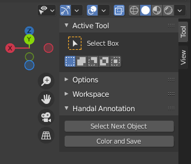

# HANDAL handle annotation tool for meshes


Their are two scrits, `load_from_all_ply_from_folder.py` loads all the ply files in a folder. `menu.py` loads a menu in blender that with two buttons in the tool pane. 



Before you can edit your meshes, you need to make sure you toggle x-ray mode. This allows you select points that are behind your point of view on the mesh. 


In order to edit the meshes, you first click on `Select Next Object` it will pick a loaded object from there you need to select the handle. Then you click `Color and Save` which will save the file as two ply files, one for the handle (denoted `*_h.ply`) and not handle (`*_n.ply`).

## Install and running scripts

In order to run the script in blender, open the `Python Console`, first run 
```
exec(compile(open("/PATH/TO/SCRIPT/handal_annotating/load_all_ply_from_folder.py").read(), "/PATH/TO/SCRIPT/handal_annotating/load_all_ply_from_folder.py", 'exec'))

```
Check your path here, check the script file to add the absolute path to where your data is. 
Once this is run, add the menu see above. 
```
exec(compile(open("/PATH/TO/SCRIPT/handal_annotating/menu.py").read(), "/PATH/TO/SCRIPT/handal_annotating/menu.py", 'exec'))

```
See above for understanding how to use the menu. In the script, you have to mention the output folder. Search for the `path` in the file to describe where you want to output the annotation. 

This code was tested on blender 2.97.